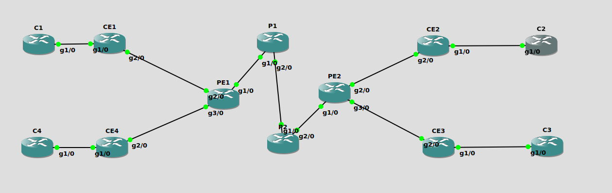

# 3TCA Projet NAS

Léo BONNAIRE Léonard PRINCE Kowsigan ALAGARAJAH Hédi SFAXI Matthieu NSI ELA Mounir RADJABOU

<hr>

The following Python module generates configs for a pre-defined backbone architecture.

It involves:
- Basic network connection
- OSPF routing within the backbone
- BGP connection with clients
- MPLS/VPN services

A backbone architecture is defined by its JSON file. An example is ``bb_config.json``

The script connect to a GNS3 server to configure automatically every ISP routers (clients routers not included).

**It requires to have a fully built GNS3 project.**

The script generate a file called ``recap.txt`` containing every router configuration.

## How to use

<hr>

(any troubles using git and GitHub ? Check [How to use Git](#how-to-use-git) section)

1. [Install and configure GNS3's server](#how-to-configure-gns3-server)
2. Create a new GNS3 project
3. Build your backbone architecture
4. Starts your routers
5. Write down the JSON file describing your architecture, including your client's edge routers
6. In a Python virtual env (see section [How to work with a Python virtual environment](#how-to-work-with-a-python-virtual-environment)), install the requirements with
```shell
pip install -r requirements.txt 
```
7. Launch script with 
```shell
python -m confgen -c <path-to-json-file> -n <gns3-project-name> [-v] [-d]
```
or try 
```shell
python -m confgen --help
```
If you encouter any problem.

The writing to the routers can take time. Make a coffe before the start of the process.

### Debug options

If you encounter some problem during running the script, try to add ``-v`` to have a more verbose output.

... or try a dry-run with the option ``-d``.

**After each run, a file ``recap.txt`` is created, making a recap of configs generated.**

### Actual architecture

The current ``bb_config.json`` describes the following architecture:



**Please, update the scheme if you modify ``bb_config.json`` !**

## How to configure GNS3 server

<hr>

The script connect to GNS3 server to retrieve the project. It is necessary to configure it correctly.

By default, the servers requires a password to connect and doesn't allow connection from any IP.

We'll need to change these two things in order to make the script working correctly.

**You'll need to close every opened GNS3 project to modify server's settings.**

In GNS3, Edit > Preferences > Server

- Check ``Enable local server``
- Uncheck ``Protect server with password``
- Check ``Allow console connections to any local IP address``

The other fields should be fine by default.

Apply the configuration. GNS3's server should restart, and you'll be able to open your project and launch the script.

## How to work with a Python virtual environment

<hr>

Python virtual environments are used to create a virtual space specific to a single project, including its dependencies.

It avoids having a dirty workspace shared among several projects having different dependencies.

**Of course, it requires to have Python installed on your machine !**

### Step 1: Create your environment

To create a virtual environment, paste the following command in your shell:

````shell
python -m venv venv
````

It will create a new folder called ``venv/`` which contains your virtual environment.

Usually these folder should not be added to git. Hence, remember to have a correct ``.gitignore`` file.

(already taken care of here)

### Step 2: Activate your environment

On Linux:
````shell
source venv/bin/activate
````

On Windows:
````shell
.\venv\Scripts\activate.bat
````

Your new prompt should now start with ``(venv)`` meaning you've activated your environment. 

You're (almost) ready to work :)

### Step 3: Install project dependencies

If your project requires some dependencies, a file called ``requirements.txt`` should exist.

To install the dependencies, run

````shell
pip install -r requirements.txt
````

You're (finally) ready to work :) :)

## How to use git

<hr>

### 1. Install git on your machine

On Windows : Install [Git Bash](https://git-scm.com/downloads)

On Linux : probably already installed (try `git --version` to check)

### 2. Configure git

#### 2.1 Configure git locally

Configure your name and email with the following commands :

```shell
$ git config --global user.name "your name here"
$ git config --global user.email "your email here"
```

#### 2.2 Connection to GitHub repo

First thing needed is to create a set of SSH keys to access this repo.

(See tutorial full here : [https://docs.github.com/fr/authentication/connecting-to-github-with-ssh](https://docs.github.com/fr/authentication/connecting-to-github-with-ssh))

Step-by-step process:

1. Generate a SSH key and add it to your SSH-agent ([detailed tutorial](https://docs.github.com/fr/authentication/connecting-to-github-with-ssh/generating-a-new-ssh-key-and-adding-it-to-the-ssh-agent))

```shell
ssh-keygen -t ed25519 -C "your_email@example.com"
```
Do not change the default folder and enter a solid passphrase.

Then add your key to your SSH agent

```shell
$ eval "$(ssh-agent -s)"
$ ssh-add ~/.ssh/id_ed25519
```

2. Add it to your GitHub profile

```shell
cat ~/.ssh/id_ed25519.pub
```
Copy the exact output of this command and paste it on [Github](https://github.com/settings/ssh/new).


### 3. Clone the repo

```shell
git clone git@github.com:leoNord462/3tca-projet-nas.git
```

This creates a folder named after the GitHub repo. `cd` to this repo to work within it.

<br>

With the above configuration, you should be able to access with read and write access to the distance repo.

### Every day use

Before working on the repo, remember to pull the changes made by other.

```shell
git pull origin <your-branch>
```

When you finished a task and want to commit your changes, use

```shell
$ git add -A  # This add your files to be commited
$ git commit -m "an-explicit-message-to-describe-your-work"  # Commit your changes on your local repo
$ git push origin <your-branch>  # Push your commit to github
```

The use of GitHub might be handy for beginners so don't hesitate to ask.

#### Work on branches

To work on a specifiq branch:

```shell
$ git fetch origin  # retrieve remote branches

$ git checkout <your-branch>  # change to branch you work on
```

**! Please, don't work on branch master. The branch master should be a clean branch. !**

When you work on a new issue, create the issue (via the milestone) and a related branch on github, then checkout locally with the above commands. When you work is done and ready for the branch master, create a pull request that will be reviewed before merging.
